# Entity-Relationship Diagram

## Mermaid ER Diagram

```mermaid
erDiagram

    %% ─── USERS & ORGANIZATIONS ──────────────────────────────────────────────

    users {
        UUID   id           PK
        string first_name
        string last_name
        string email        UK
        string password
        string role
        string status
        ts     created_at
        ts     updated_at
        string created_by
        string updated_by
    }

    organizations {
        UUID   id           PK
        string name
        string slug         UK
        string description
        string status
        ts     created_at
        ts     updated_at
        string created_by
        string updated_by
    }

    organization_members {
        UUID   id              PK
        UUID   user_id         FK
        UUID   organization_id FK
        string role
        ts     created_at
        ts     updated_at
        string created_by
        string updated_by
    }

    %% ─── PROJECTS & QUEUES ───────────────────────────────────────────────────

    projects {
        UUID   id              PK
        UUID   organization_id FK
        UUID   owner_id        FK
        string name
        string slug
        string description
        string status
        ts     created_at
        ts     updated_at
        string created_by
        string updated_by
    }

    job_queues {
        UUID   id          PK
        UUID   project_id  FK
        string name
        string description
        int    concurrency
        int    max_retries
        string status
        ts     created_at
        ts     updated_at
        string created_by
        string updated_by
    }

    retry_policies {
        UUID   id               PK
        UUID   queue_id         FK "UK"
        string backoff_strategy
        int    max_attempts
        bigint initial_delay_ms
        bigint max_delay_ms
        float  multiplier
        bool   jitter_enabled
        ts     created_at
        ts     updated_at
        string created_by
        string updated_by
    }

    %% ─── WORKERS ─────────────────────────────────────────────────────────────

    workers {
        UUID   id                PK
        string worker_id         UK
        string hostname
        string ip_address
        string version
        string status
        ts     last_heartbeat_at
        int    active_job_count
        int    max_concurrency
        ts     registered_at
        ts     deregistered_at
        ts     created_at
        ts     updated_at
        string created_by
        string updated_by
    }

    worker_heartbeats {
        UUID   id               PK
        UUID   worker_id        FK
        ts     received_at
        int    active_job_count
        int    heap_used_mb
        float  cpu_load
    }

    %% ─── JOBS ────────────────────────────────────────────────────────────────

    jobs {
        UUID   id             PK
        UUID   queue_id       FK
        UUID   worker_id      FK "nullable"
        string name
        string type
        string status
        jsonb  payload
        string cron_expression
        ts     scheduled_at
        ts     started_at
        ts     completed_at
        int    attempt_count
        int    max_attempts
        string last_error
        int    priority
        string correlation_id
        string message_id
        ts     created_at
        ts     updated_at
        string created_by
        string updated_by
    }

    job_executions {
        UUID   id              PK
        UUID   job_id          FK
        UUID   worker_id       FK
        int    attempt_number
        string status
        ts     started_at
        ts     finished_at
        bigint duration_ms
        text   error_message
        jsonb  result_payload
        string worker_hostname
        ts     created_at
        ts     updated_at
        string created_by
        string updated_by
    }

    %% ─── SCHEDULING ──────────────────────────────────────────────────────────

    scheduled_jobs {
        UUID   id               PK
        UUID   queue_id         FK
        string name
        string description
        string type
        string cron_expression
        ts     run_at
        ts     next_run_at
        ts     last_run_at
        jsonb  payload_template
        int    priority
        int    max_attempts
        bool   enabled
        string timezone
        ts     created_at
        ts     updated_at
        string created_by
        string updated_by
    }

    %% ─── DLQ & AUDIT ─────────────────────────────────────────────────────────

    dead_letter_entries {
        UUID   id               PK
        UUID   job_id           FK "UK"
        UUID   queue_id         FK
        jsonb  payload_snapshot
        text   failure_reason
        int    total_attempts
        ts     dead_at
        bool   replayed
        ts     replayed_at
        UUID   replayed_job_id
        ts     created_at
        ts     updated_at
        string created_by
        string updated_by
    }

    audit_logs {
        UUID   id           PK
        string entity_type
        string entity_id
        string action
        string actor_id
        string actor_name
        jsonb  before_state
        jsonb  after_state
        jsonb  metadata
        ts     occurred_at
        string trace_id
    }

    %% ─── RELATIONSHIPS ───────────────────────────────────────────────────────

    users                 ||--o{ organization_members : "belongs to"
    organizations         ||--o{ organization_members : "has members"

    organizations         ||--o{ projects             : "owns"
    users                 ||--o{ projects             : "owns (creator)"

    projects              ||--o{ job_queues           : "contains"

    job_queues            ||--o| retry_policies       : "has policy"
    job_queues            ||--o{ jobs                 : "receives"
    job_queues            ||--o{ scheduled_jobs       : "defines"
    job_queues            ||--o{ dead_letter_entries  : "accumulates"

    workers               ||--o{ worker_heartbeats    : "emits"
    workers               ||--o{ jobs                 : "executes"
    workers               ||--o{ job_executions       : "records"

    jobs                  ||--o{ job_executions       : "has attempts"
    jobs                  ||--o| dead_letter_entries  : "dies into"
```

---

## Relationship Explanations

### users ↔ organizations (via organization_members)
Many-to-many resolved by `organization_members`. A user can be a member of
multiple organizations, each with a different role (OWNER, ADMIN, MEMBER, VIEWER).
The system-level `users.role` (ADMIN/USER) is separate from the org-scoped role.

### organizations → projects
One-to-many. An organization owns many projects. Deleting an organization
cascades to all its projects (and transitively to queues and jobs).

### users → projects (owner_id)
Many-to-one. Each project has exactly one owner (the user who created it).
`ON DELETE RESTRICT` prevents deleting a user who owns projects.

### projects → job_queues
One-to-many. A project contains many named queues. Queue names are unique
within a project (composite unique constraint).

### job_queues → retry_policies (one-to-one)
Each queue has at most one retry policy. If absent, the queue's `max_retries`
column is used with a default FIXED backoff. `ON DELETE CASCADE` removes the
policy when the queue is deleted.

### job_queues → jobs
One-to-many. Jobs are submitted to a specific queue. The queue controls
concurrency and default retry behaviour.

### workers → jobs (worker_id nullable)
Many-to-one, nullable. A job references the worker currently executing it.
`ON DELETE SET NULL` — if a worker record is deleted, jobs lose the reference
but are not deleted. Null means the job is not currently running.

### jobs → job_executions
One-to-many. Every time a worker picks up a job, a new `job_executions` row
is inserted. The `(job_id, attempt_number)` unique constraint prevents
duplicate attempt records. Rows are never updated — append-only.

### workers → job_executions
One-to-many. A worker accumulates execution records over its lifetime.
`ON DELETE RESTRICT` — cannot delete a worker that has execution history
(preserves audit trail).

### workers → worker_heartbeats
One-to-many, append-only time-series. One row per heartbeat received.
Old rows are purged by a scheduled cleanup job (keep last 24h).

### job_queues → scheduled_jobs
One-to-many. A queue can have many scheduled job definitions (cron, delayed,
one-shot). The scheduler reads `next_run_at` to spawn concrete `jobs` rows.

### jobs → dead_letter_entries (one-to-one)
A job can only die once. When `attempt_count >= max_attempts`, the job status
is set to DEAD and a `dead_letter_entries` row is inserted with a full payload
snapshot. The `queue_id` FK is denormalized for efficient per-queue DLQ queries.

### audit_logs (no FKs — polymorphic)
`entity_type` + `entity_id` form a soft polymorphic reference. No FK constraints
are used intentionally — audit logs must survive entity deletion. The `action`
column uses a controlled vocabulary (e.g. `JOB_SUBMITTED`, `QUEUE_PAUSED`).

---

## 3NF Compliance Notes

| Table | 3NF Justification |
|---|---|
| `organization_members` | Resolves User↔Org M:M; `role` depends on the composite key (user_id, org_id) |
| `retry_policies` | Separated from `job_queues` — retry config is an independent entity with its own lifecycle |
| `job_executions` | Separated from `jobs` — execution-specific data (timing, error, result) would form repeating groups on `jobs` |
| `worker_heartbeats` | Separated from `workers` — time-series data; one row per event, not one column per heartbeat |
| `scheduled_jobs` | Separated from `jobs` — template vs instance distinction; avoids NULLs on non-recurring jobs |
| `dead_letter_entries` | Separated from `jobs` — DLQ data is sparse (only failed jobs); avoids NULLs on healthy jobs |
| `audit_logs` | Fully independent; no transitive dependencies; polymorphic by design |
